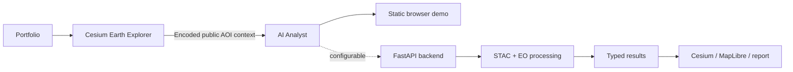

# Portfolio ecosystem architecture

The portfolio and Explorer are static GitHub Pages. They do not execute Python. The Explorer produces an EPSG:4326 point/radius analysis request and requires confirmation in the Analyst. No private token is required.
